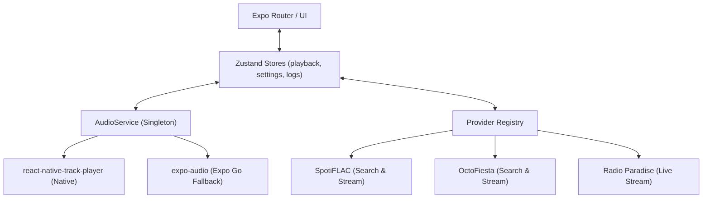

# TapeDeck

TapeDeck is a production-quality, cross-platform mobile music player focused on high-quality streaming (FLAC/lossless) with a rich, tactile cassette-deck and vintage Sony Walkman-inspired visual identity. Built with React Native, Expo, and strict TypeScript.

## Architecture

TapeDeck employs a layered architecture separating UI, State, Audio Playback, and Provider selection:



## Prerequisites

- Node.js >= 18
- npm or yarn
- Expo CLI (`npm install -g expo-cli`)
- iOS Simulator or Android Emulator (for development builds)

## Installation

1. Clone the repository
2. Install dependencies:
   ```bash
   npm install --legacy-peer-deps
   ```
   *(Note: Due to the complexity of native audio dependencies, use legacy-peer-deps if you encounter resolution issues).*

3. Start the application:
   ```bash
   npx expo start
   ```

### Expo Go vs Development Builds

TapeDeck utilizes `react-native-track-player` for robust background audio and lock screen controls. This requires a **custom development build**:

```bash
# Android
npx expo run:android

# iOS
npx expo run:ios
```

**Expo Go Limitations:**
When running in Expo Go, TapeDeck automatically detects the environment and falls back to `expo-audio`. Features like background playback, FLAC gapless transition, and lock screen controls will be unavailable.

## Provider Configuration

TapeDeck supports multiple dynamic audio providers:

1. **SpotiFLAC** (Default): Mirror pool resolution.
2. **OctoFiesta**: Configurable REST API. You can set the base URL in the Developer Options or via `.env`.
3. **Radio Paradise**: Live FLAC streams.

Copy `.env.example` to `.env` to set default provider configurations.

## Developer Options Guide

TapeDeck includes a built-in diagnostic and developer suite. 

To access it:
1. Navigate to the **Settings** tab.
2. Select the **BENCH** (Maintenance) sub-tab.
3. Tap **OPEN DEVELOPER OPTIONS**.

Features available:
- **Active Provider Selection**: Force the app to use a specific provider for testing.
- **Global Behavior**: Toggle Verbose Logging and Auto-Fallback features.
- **Provider Overrides**: Inject custom URLs for OctoFiesta.
- **Diagnostics**: Test all providers concurrently to check latency and health.
- **Report Export**: Generate a sanitized JSON telemetry report for debugging.
- **Log Preview**: View the in-memory ring-buffered logs directly in the UI.

## Testing Commands

TapeDeck uses Jest and React Native Testing Library. Run the test suite via:

```bash
npm run test
```

For linting and TypeScript validation:

```bash
npm run lint
npx tsc --noEmit
```

## Known Limitations

- **FLAC Support**: FLAC playback is highly dependent on the OS and the backend. `react-native-track-player` fully supports it, but `expo-audio` might have inconsistent behavior on certain older Android models.
- **Queue/Library**: The current v1 scope focuses on core playback, live tuning, and search. Extended library features (mixtapes, shelves) are slated for future releases.
- **Search Pagination**: Archive search currently returns the top 50 results. Infinite scrolling is a planned enhancement.
